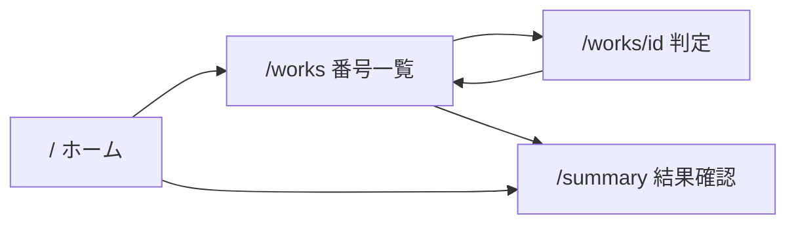

# 参照ガイド（AI・実装者向け）

| 読むべきファイル | 用途 |
|------------------|------|
| **このファイル `PROJECT_PLAN.md`** | アプリの**唯一の詳細仕様書**（画面・操作・データ・ビジュアル・リスク）。実装・レビュー・別セッションの AI は**まずここを全文読む**。 |
| （任意）参考ムード画像 | 質感の参照のみ。ポスター密度は再現しない。ローカルパス: `/Users/mori-mori/.cursor/projects/Users-mori-mori-singan-kanteishi/assets/image-e56b8916-dea1-4b26-b857-a24d2dcfb460.png` — **アプリに埋め込む場合は** `public/` 以下へコピーして参照する。 |
| Cursor 内の計画ファイル | `~/.cursor/plans/鑑定アプリ_next.js_88b8ef8f.plan.md` — 本ドキュメントと**同一内容**を保つ意図（Cursor の Plan UI 用）。ズレたら **`PROJECT_PLAN.md` を正**とする。 |

---

# 贋作鑑定士向け判定アプリ（Next.js / Tailwind）実装計画

## 概要

空のリポジトリに Next.js（App Router）+ TypeScript + Tailwind で、20点のダミー作品を「本物 / 偽物 / 保留」で記録するスマホ向けミニマル Web アプリを構築する。状態は **localStorage** に永続化する。

ビジュアルは **黒〜チャコール地** に **くすんだネオンピンク** の細線・**微細ノイズ** で「観測端末／機密アーカイブ」の空気感を出しつつ、**情報密度は抑え**て会場体験を邪魔しない。

## 前提

- ワークスペース `/Users/mori-mori/singan_kanteishi` で [create-next-app](https://nextjs.org/docs/app/api-reference/cli/create-next-app) により **App Router + TypeScript + Tailwind + ESLint** の新規プロジェクトを生成する（`src/` あり推奨）。
- **スワイプ**はタッチイベント（＋開発用マウス）で実装し、重いジェスチャーライブラリは使わない。カード山・大きな弾みなど **Tinder 風の軽いマッチング UI** は避け、閾値超過で静かに確定 → 一覧へ戻る流れを優先する。
- **横スワイプとブラウザ履歴**: iOS Safari 等で横スワイプが「戻る」と干渉することがある。必要に応じて **`overscroll-behavior-x: none`**（コンテナに付与）や判定エリアの調整を検討する。
- **タッチリスナー**: `touchmove` で **`preventDefault` する場合**は **`{ passive: false }`** でリスナーを登録する必要があることがある（未指定だとブラウザが警告し、意図どおり動かない場合あり）。

## 情報設計と永続化

- **ダミー20件**: 固定配列（`id: 1..20`、短い **ケース名／一行メタ**）。長文キャプションは置かない。
- **判定値**: `undecided` | `authentic` | `fake` | `pending`。
- **localStorage**: 単一キー（例: `singan-kanteishi:v1`）に `Record<number, Judgment>`。**`'use client'`** または **`useJudgments`** でマウント後読込し、ハイドレーション不一致を防ぐ。

## 画面構成（4画面）

| 画面 | ルート案 | 役割 |
|------|-----------|------|
| ホーム | `/` | **タイトル**、**短い説明**（1〜2行）、主導線 **「判定を始める」**（`/works`）。副次で **結果確認**（`/summary`）は小さく控えめに。 |
| 番号一覧 | `/works` | **1〜20 のシンプルなグリッド**。各セルに番号＋状態（未判定 / 本物 / 偽物 / 保留）。**1px 罫線**とタイポ／極小の状態記号。タップで `/works/[id]`。 |
| 判定 | `/works/[id]` | **番号とケース名を大きく**。**右スワイプ＝本物 / 左スワイプ＝偽物**。**本物・偽物・保留のいずれも、スワイプに加えてフォーカス可能なボタン（または同等のコントロール）で必ず選択可能**にする（初期要件の「3ボタン」とアクセシビリティを満たす）。保留は下部固定のピル／アウトライン風でタップしやすく。確定後は **即 `/works` へ** など、開きっぱなしにしない。 |
| 結果確認 | `/summary` | 判定一覧。未判定は沈んだトーン。フッターから **一覧へ**。 |

## 判定画面の操作

- **スワイプ**: 水平ドラッグ量で閾値判定（例: 80px）。フィードバックは線色のわずかな変化や 1px シフト程度。
- **ボタン**: `saveJudgment(id, value)` に集約。**本物・偽物・保留をすべて**明示的にタップ可能にする（セーフエリア対応）。
- **アクセシビリティ**: `aria-label`、**キーボード／スクリーンリーダーで全状態を再現可能**にする（スワイプのみに依存しない）。

## デザイン方針（質感の抽出／ミニマル UI）

参考画像から取り入れるのは **質感と空気感のみ**。ポスター的な情報密度・ALL CAPS の羅列・図版だらけの画面にはしない。

- **背景**: チャコール〜ニアブラック（例 `#0a0a0a` 付近）。段階で静かな奥行き。
- **アクセント**: くすんだネオンピンク（焼けたピンク、例 `#D16B8D` 前後を CSS 変数化）。**細い罫線・フォーカス・区切り・重要な一語**に使い、面で塗りつぶさない。
- **ノイズ**: ごく低不透明度のノイズレイヤー（SVG フィルタ／繰り返しパターン等）。**固定オーバーレイ + `pointer-events: none`**。派手なアニメーションは付けない。
- **ライン**: **1px** のボーダーのみ。大きなドロップシャドウ・強いグラデーションは避ける。
- **タイポ**: 洗練された **モノスペース寄り**を主軸（`IBM Plex Mono` / `JetBrains Mono` / `Geist Mono` 等、`next/font`）。日本語は **読めるサンセリフ** を補助（Noto Sans JP 等）。本文は読みやすさ優先。
- **記号的装飾**: 控えめに観測端末っぽい表記（例: `// OBS`、`CASE_07`）。主役にしない。
- **図版的モチーフ（任意）**: **極低透明度**の正弦波・十字線などを背景の一角のみ（操作域を侵さない）。
- **全体トーン**: 高級感・静かで不穏・秘密の鑑定機関の端末。ポップ／カジュアルは避ける。余白大、長文なし。

## 技術メモ（Tailwind）

- `max-w-md mx-auto min-h-dvh`。フッターに `env(safe-area-inset-bottom)`。
- 色は **CSS 変数**（`:root`）で `--bg`, `--fg`, `--line`, `--accent` 等を定義。

## 主要ファイル構成（想定）

- `src/app/layout.tsx` — フォント、`metadata`、全体背景＋ノイズラッパ
- `src/app/globals.css` — CSS 変数、ノイズ用クラス
- `src/app/page.tsx` — ホーム
- `src/app/works/page.tsx` — 一覧グリッド
- `src/app/works/[id]/page.tsx` — 判定
- `src/app/summary/page.tsx` — 結果確認
- `src/lib/dummyWorks.ts` — 20件ダミー
- `src/lib/judgmentsStorage.ts`
- `src/hooks/useJudgments.ts`

## 実装順序

1. `create-next-app`
2. 型・ダミーデータ・localStorage・`useJudgments`
3. ダークテーマ＋ピンク罫線＋ノイズ＋フォント
4. 4ルートと導線
5. スワイプ＋**三本柱ボタン**、一覧・サマリ連動
6. 実機: タップ領域・コントラスト・横スワイプ干渉

## リスクと回避

- **SSR と localStorage**: マウント後同期。
- **無効 id**: `1`〜`20` 以外は `/works` へリダイレクト。
- **ノイズとパフォーマンス**: `will-change` の濫用を避ける。重い場合はノイズを一部画面のみに限定する判断余地あり。

## 作業チェックリスト（TODO）

- [ ] create-next-app（App Router, TS, Tailwind, src/）
- [ ] ダミー20件・判定型・localStorage + `useJudgments`
- [ ] ダーク基調・ネオンピンク罫線・微細ノイズ・モノスペ系フォント・max-w-md
- [ ] ホーム・一覧・判定・サマリの4ルートと導線
- [ ] 判定: 右/左スワイプ + **本・偽・保留すべて**のボタン、a11y、確定後遷移
- [ ] 一覧グリッドの状態表示・サマリ・無効 id

---

*最終更新: 仕様の正は常にこの `PROJECT_PLAN.md`。Cursor 側プランと差分があれば本ファイルに合わせて同期すること。*
